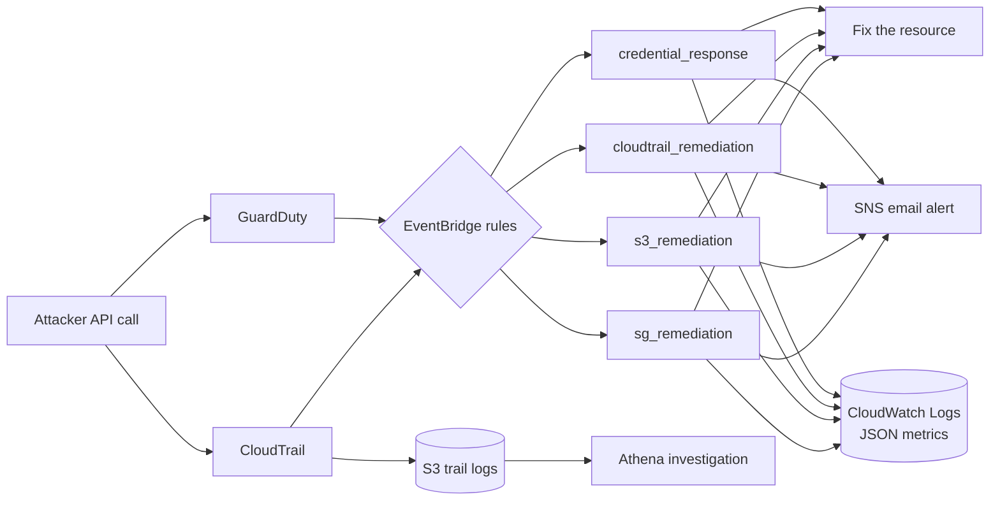

# AWS Automated Threat Detection & Response

Event-driven pipeline that detects common AWS attack techniques and fixes them automatically, usually before an attacker can use them. Attacks are emulated with [Stratus Red Team](https://github.com/DataDog/stratus-red-team), and every automated action is logged with its time to remediate.

## Results

<!-- Fill in from queries/logs_insights.txt query 1 after running the scenarios. -->

| Scenario | Stratus technique | Automated response | Median time to remediate |
|---|---|---|---|
| SSH opened to the internet | `aws.exfiltration.ec2-security-group-open-port-22-ingress` | Rule revoked | [X] s |
| S3 bucket backdoored to external account | `aws.exfiltration.s3-backdoor-bucket-policy` | Grant removed, Block Public Access enforced | [X] s |
| CloudTrail logging stopped | `aws.defense-evasion.cloudtrail-stop` | Logging restarted | [X] s |
| EC2 role credentials stolen | `aws.credential-access.ec2-steal-instance-credentials` | Stolen sessions revoked | [X] s detection + [X] s response |

Time to remediate is measured from the attacker's API call (`eventTime` in CloudTrail, or `eventFirstSeen` in GuardDuty) to the completed fix.

## Architecture



| Responder | Trigger | Action |
|---|---|---|
| `sg_remediation` | `AuthorizeSecurityGroupIngress`, `ModifySecurityGroupRules` | Revokes ingress rules exposing sensitive ports (default 22, 3389, or all traffic) to `0.0.0.0/0` or `::/0`. Other rules, like 443, are left alone. |
| `s3_remediation` | `PutBucketPolicy`, `PutBucketAcl`, `DeleteBucketPublicAccessBlock` | Re-enables Block Public Access and removes policy statements granting access to anyone outside the account or a trusted-account list. |
| `cloudtrail_remediation` | `StopLogging`, `DeleteTrail`, `UpdateTrail`, `PutEventSelectors` | Restarts stopped logging. Other changes are alert-only, since auto-reverting trail config could fight a legitimate admin. |
| `credential_response` | GuardDuty findings, severity ≥ 4 | Deactivates leaked IAM user keys. For stolen role credentials, attaches a deny policy for sessions issued before now, which kills the stolen session while letting legitimate new sessions work. |

### Design decisions

- **Least privilege per responder.** Each Lambda has its own IAM role with only the actions it needs. The S3 responder cannot touch IAM; the SG responder cannot touch S3.
- **Re-read state instead of trusting the event.** The SG responder describes the group's current rules rather than parsing the request, which differs between APIs.
- **Loop protection.** Responders ignore API calls made by their own role, so a fix never triggers itself.
- **Dry-run mode.** With `dry_run = true`, responders log and alert but change nothing. Deploy this way first.
- **Testable logic.** All decisions (what is dangerous) live in `lambda/logic.py` with no AWS calls, covered by unit tests. Handlers only apply the decision.

## Deploy

**Use a dedicated sandbox AWS account.** The responders act on every matching resource in the region, and Stratus creates real attack infrastructure.

Prerequisites: Terraform ≥ 1.5, AWS CLI configured for the sandbox account, Python 3.12 (for tests), and optionally [Stratus Red Team](https://github.com/DataDog/stratus-red-team).

```bash
cd terraform
cp terraform.tfvars.example terraform.tfvars   # set alert_email; keep dry_run = true
terraform init
terraform plan
terraform apply
```

Confirm the SNS subscription email AWS sends you, or alerts won't arrive.

If `apply` fails because GuardDuty or a trail already exists, set `enable_guardduty = false` or `create_trail = false` and apply again.

## Test

```bash
# Unit tests (no AWS needed)
pip install -r requirements-dev.txt
pytest -q

# Quick live check: opens SSH on a throwaway SG and times the fix
export AWS_REGION=eu-west-1
./scenarios/manual_sg_test.sh
```

In dry-run mode you'll get the alert but the rule stays open. When alerts look right, set `dry_run = false` in `terraform.tfvars`, run `terraform apply`, and repeat.

Then run the real attack techniques:

```bash
./scenarios/run_scenarios.sh                     # three fast scenarios, ~20 min
./scenarios/run_scenarios.sh --with-credentials  # adds the GuardDuty scenario (slow, launches EC2)
```

## Measure and investigate

- **Results table:** open CloudWatch Logs Insights, select the four `/aws/lambda/cdr-*` log groups, and run the queries in `queries/logs_insights.txt`.
- **Incident investigation:** create the Athena table in `queries/athena_cloudtrail.sql` to query raw CloudTrail logs, for example to rebuild the timeline of everything an attacker's principal did.

## Cost

Roughly a few dollars a month in a quiet sandbox account, but check your own bill.

- **GuardDuty:** 30-day free trial, then usage-based.
- **CloudTrail:** the first trail's management events are free. A second trail is billed, so set `create_trail = false` if one exists.
- **Lambda, EventBridge (AWS service events), SNS email:** effectively free at this volume.
- **Stratus credential scenario:** runs an EC2 instance for the duration of the test.

Set an AWS Budget alarm before deploying. Tear everything down with `terraform destroy`.

## Known limitations

- **Single region.** EventBridge rules are regional; activity in other regions is logged by the multi-region trail but not auto-remediated.
- **Event delivery delay.** CloudTrail events typically reach EventBridge within minutes, not instantly. That window is an attacker's opportunity and is visible in the results.
- **GuardDuty is slow for credential theft.** Findings can take 15+ minutes; response time is dominated by detection time.
- **`PutRolePolicy` on all roles is powerful.** The credential responder can modify any role not on the protected list. Compromising this Lambda would be valuable to an attacker; in production it should run in a separate security account.
- **Conservative S3 rules.** A `*` principal is kept only if a condition scopes it to an account or org (`aws:SourceAccount`, `aws:PrincipalOrgID`, etc.). Legitimate but unusual public patterns will be removed.
- **Alert-only trail tampering.** Deleted or reconfigured trails are reported, not restored.
- **Checkov findings.** Some are accepted for a lab (e.g. Lambdas not in a VPC, no dead-letter queue, SNS without a customer-managed KMS key) and reported with `soft_fail`.

## Repository layout

```
├── lambda/                  # responders + shared logic
│   ├── logic.py             # pure decision logic (unit tested)
│   ├── common.py            # metrics, alerts, loop protection
│   └── *_remediation.py, credential_response.py
├── terraform/               # all infrastructure
├── tests/                   # pytest unit tests
├── scenarios/               # Stratus runner + manual SG test
├── queries/                 # Logs Insights + Athena queries
└── .github/workflows/ci.yml # tests, terraform validate, Checkov
```
